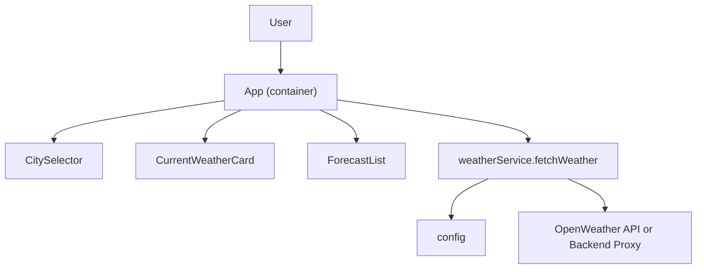

## Weather App Refactor Plan

### Goals
- **Code quality**: Simplify and modularize `App` logic, add basic typing/validation, and improve maintainability.
- **Reliability & UX**: Add loading, error, and empty states so API issues do not result in blank UI.
- **Security hygiene**: Remove the hardcoded API key from source, centralize configuration, and prepare for an optional backend proxy.
- **Performance**: Avoid unnecessary re-renders and duplicate network work, and use simple caching where it helps.

### Current State (Summary)
- **Single monolithic component**: All logic and UI live in `src/App.js`.
- **Hardcoded API key**: `API_KEY` is a plain string in the bundle, visible to anyone.
- **No explicit loading/error handling**: UI only renders once `weatherData` is non-null.
- **Direct `fetch` calls**: Two sequential `fetch` calls for current weather and forecast on each city change.
- **Tight coupling of data & presentation**: `App` both orchestrates API calls and renders all layouts.

### High-Level Refactor Approach
1. **Introduce a dedicated weather service layer** under `src/` to encapsulate API calls and response shaping.
2. **Move configuration and secrets out of code** by using environment variables and a central config module.
3. **Split `App` into presentational components** for current weather, forecast list, and city selector.
4. **Add robust state management around the API calls** (loading, error, last-updated, retry).
5. **Optimize network usage and rendering** with memoization and simple request de-duplication.
6. **Optionally, add a backend proxy design** (documented) to fully hide the API key in production.

### Proposed File and Module Changes

- **Configuration & API Layer**
  - **New file**: `src/config.js`
    - Read `REACT_APP_WEATHER_API_KEY` and `REACT_APP_WEATHER_API_BASE` from environment variables.
    - Export a function that throws or logs a clear error if the API key is missing at runtime.
  - **New file**: `src/services/weatherService.js`
    - Export `fetchWeather(city)` that internally performs the two `fetch` calls.
    - Normalize the response shape into `{ cityName, current, forecast }`, keeping only fields needed by the UI.
    - Handle HTTP errors and network issues with structured error objects (e.g. `{ type, message, status }`).
    - Expose a single, promise-based API used by UI components.

- **UI Components**
  - **Refactor** `src/App.js`
    - Keep it as a thin container component responsible for:
      - Managing `city`, `weather`, `isLoading`, `error`, and `lastUpdated` state.
      - Calling `weatherService.fetchWeather` inside `useEffect` in response to city changes.
      - Passing data to child presentational components.
    - Remove direct `fetch` calls and hardcoded API key from this file.
  - **New file**: `src/components/CitySelector.js`
    - Stateless component receiving `value`, `onChange`, and `options` props.
    - Encapsulate the `<select>` logic and city list data.
  - **New file**: `src/components/CurrentWeatherCard.js`
    - Presentational component that displays the main city name and current temperature/conditions.
  - **New file**: `src/components/ForecastList.js`
    - Renders the forecast list, limited to a configurable number of entries (default 2).
    - Each item represents a normalized forecast entity from the service layer.

- **States, Error Handling, and UX**
  - **Improve app state in `App`**
    - Add `isLoading` boolean for network in-flight state.
    - Add `error` state to capture errors from `weatherService`.
    - Show a loading indicator when fetching data.
    - Show a clear error message and a retry button if fetching fails.
    - Keep and display `lastUpdated` timestamp when data was successfully fetched.
  - **Edge cases**
    - Handle unknown city or invalid API key by displaying user-friendly messages instead of silent failure.
    - Guard against missing `weather[0]` or `main` fields in responses.

- **Performance Improvements**
  - **Avoid duplicate requests**
    - Inside the `useEffect`, track an `AbortController` to cancel in-flight requests if the user changes city quickly.
    - Ensure that rapid `city` changes do not race and cause out-of-order state updates.
  - **Memoization & derived data**
    - Use `useMemo` for derived values like `shortForecast` if needed (e.g., slicing and mapping forecast data).
  - **Optional simple cache** (if desired)
    - Implement a small in-memory cache in `weatherService` keyed by `city` with a short TTL (e.g. 60 seconds).
    - Return cached data immediately while optionally revalidating in the background.

- **Security and Backend Proxy Option**
  - **Frontend hygiene**
    - Remove `API_KEY` constant from `src/App.js`.
    - Document the required `.env` variables in this plan (and later in `README`).
  - **Optional backend proxy design (documented only)**
    - Describe a simple Node/Express or serverless function that:
      - Accepts `city` as a query parameter.
      - Reads the OpenWeather API key from a secure server-side env variable.
      - Calls the upstream API and returns sanitized JSON to the client.
    - Update `weatherService` API base URL to point to this proxy in production.

- **Testing & Monitoring**
  - Use the existing `src/App.test.js` as a starting point.
  - Add at least basic tests for:
    - Rendering loading and error states in `App`.
    - `CitySelector` correctly invoking `onChange`.
    - `weatherService.fetchWeather` shaping data as expected (with mocked `fetch`).

### Data Flow Diagram (Post-Refactor)

